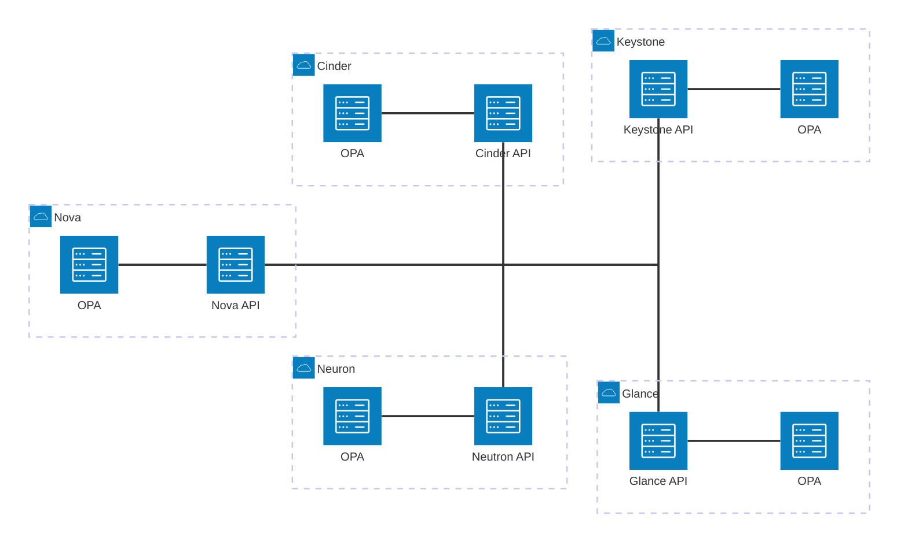

+++
draft = false
title = "Dynamic OpenStack authorization policies with Open Policy Agent"
description = "How to integrate `oslo.policy` with Open Policy Agent to build dynamic and easy reconfigurable policies and stop worrying about role explosion"
date = "2025-07-17"
author = "Artem Goncharov"
+++

# Dynamic Keystone policies with Open Policy Agent

At SysEleven, we offer a diverse portfolio of services including OpenStack,
Kubernetes, Monitoring and Observability, Database as a Service, and more. Each
of these services implements authentication and authorization in distinct ways.
Our goal is to provide customers with a more homogeneous and manageable
experience, offering a single UI and unified credential usage (e.g., a service
account for one system should function across others). While logically
appealing, this endeavor is highly non-trivial to implement.

To address this, we've made the strategic decision to build a central Identity
Access Management (IAM) platform. A relatively new and increasingly popular
approach in authorization is Relationship-Based Access Control (ReBAC),
currently adopted by major market players. ReBAC models action authorization
based on the presence of direct or indirect connections between two nodes in a
graph. We leverage OpenFGA, an open-source software that enables the description
of desired node types (actors and targets) and edges (e.g., reader, writer,
admin). OpenFGA is integrated with Keycloak, which handles user management and
authentication.

Integrating OpenStack Keystone with external identity systems, while
challenging, is feasible. Work is ongoing to enhance federation support within
Keystone. However, a significantly larger challenge lies in integrating
OpenStack with an external authorization service. Currently, we rely on
OpenStack roles, with role assignments being pulled by Keystone from OpenFGA
during user login. This is not an optimal long-term solution. We are actively
developing a different integration approach that queries OpenFGA directly
whenever user roles information is required, effectively decentralizing role
assignment storage from the database.

A frequent question from OpenStack operators concerns the possibility of
achieving more fine-grained roles than the simplistic "reader," "member," and
"manager." Adding even a few such granular roles quickly leads to a "role
explosion", making maintenance exceedingly complex. To understand this
challenge, let's first examine the fundamentals of OpenStack's authorization
implementation.


## OpenStack authorization model

OpenStack's authorization model is a hybrid of Role-Based Access Control (RBAC)
and Attribute-Based Access Control (ABAC). A user is assigned a role (either
directly or via group membership) on a specific target (project, domain, or
system). Each time a user performs an API operation, a set of conditions is
evaluated to make an authorization decision:

- Does the user possess the required role?

- Is the role assigned within the project the user is currently attempting to
  use?

- Is the user an administrator, permitted to perform the operation regardless of
  scope?

- Is the user the owner of the target resource?

- ...and so forth.

These checks are unique to each operation and are defined in the service's
source code using the `oslo.policy` library. Policies are represented as strings,
for example: `"identity:get_application_credential":
"(rule:admin_required) or (role:reader and system_scope:all) or rule:owner"`

In human language, this translates to: The `get_application_credential` operation
of the identity service is allowed if any of the following conditions are true:

- `rule:admin_required` evaluates to True (meaning the user has an admin role).

- `role:reader and system_scope:all` (meaning the user has a reader role and is
  authorized with the system scope, targeting all resources).

- `rule:owner` (meaning the user is the owner of the resource).

Yes, these policies are embedded "in the source code." Fortunately, it's
possible to override the default policy with a configuration file.
Unfortunately, this requires deploying a new policy file to every node and
restarting/reloading the respective process. This limitation effectively
precludes any consideration of dynamic authorization.


## Outsorcing the authorization

Given the limitations of dynamic roles with `oslo.policy`, the question arises: is
it possible to delegate authorization decisions to an external system like
OpenFGA? Indeed, it's possible to create an `oslo.policy` plugin that performs
external actions, such as an HTTP call to an external system, library
invocation, or other methods. Since we use OpenFGA as our core authorization
system, our initial idea was to write a plugin to query OpenFGA.

However, the fundamental differences between ReBAC, RBAC, and ABAC quickly
became apparent. It became clear that implementing complex OpenStack policies
purely with the ReBAC model would be unacceptably complex for any "regular
mortal." As mentioned, OpenStack employs a hybrid of RBAC and ABAC, and while
technically certain aspects could be covered by ReBAC, the complexity renders it
very impractical. Furthermore, some OpenStack policies integrate dynamic data
into the evaluation, meaning this responsibility cannot simply be shifted to
operations staff.

OpenFGA is not the only solution for implementing authorization systems. Open
Policy Agent (OPA) is another major player with well-established integrations
across Kubernetes, Ceph, Terraform, and many others. It can even integrate into
the PAM layer on Unix systems for operating system-level permission control.
Implementing OpenStack policies using OPA's Rego language is remarkably
straightforward. OPA inherently supports graph theory within its policies,
allowing existing OpenStack policies to be naturally represented in Rego and
extended with dynamic data and ReBAC-style assignments, ultimately providing the
desired flexibility.

### Open Policy Agent Rego language

Rego, as mentioned, is OPA's policy language. It is not necessarily intuitive
but is far from unnecessarily complicated.

Let's analyze the `oslo.policy` description for listing application credentials:

```yaml
"identity:list_application_credentials": "(rule:admin_required) or (role:reader and system_scope:all) or rule:owner
"admin_required": "role:admin or is_admin:1"
"owner": "user_id:%(user_id)s"
```

This policy permits the API request for admin users (either with the "admin"
role or "is_admin" flag set to 1), or for users with a "reader" role assigned
for a system-scoped token, or if the user is the owner of the application
credentials (identified by comparing the request's "user_id" with the
authenticated user's id).

Such a policy can be represented in Rego as follows:

```
allow if {
  # role:admin
  "admin" in input.credentials.roles
}

allow if {
  # role:reader and system_scope:all
  "reader" in input.credentials.roles
  input.credentials.system_scope == "all"
}

allow if {
  # user_id:%(user_id)s
  input.credentials.user_id == input.target.user_id
}
```

The example above defines three rules, each with "allow" as the rule header,
signifying a final authorization decision. The use of the same header creates an
"OR" effect, instructing OPA to permit the request if at least one rule
evaluates to true.

The first rule ensures "admin" is present in the credential roles list. The
second evaluates to true when credential roles contain "reader" AND the
system_scope credential attribute is "all." The final rule validates that the
user_id attribute of the credential equals the user_id attribute of the target.
All these rules are evaluated in parallel, and as soon as one is true, further
evaluation is aborted, and the result is returned immediately.

Now, let's explore how to implement fine-grained access by granting a user this
specific rule individually, without allocating new roles. This is where ReBAC
excels: every API operation can be considered a separate target accessible by a
user through a direct relationship. Technically, this isn't fundamentally
different from current implementations, where access to an API operation is
granted through roles.


```
...
allow if {
    data.assignments["list_application_credentials"][input.credentials.user_id]
}
```

With this addition, OPA also permits the request if the user_id entry exists in
the supplementary data.assignments under the "list_application_credentials"
section. OPA separates policies from data objects (simple JSON blobs); data can
be utilized by policies. Such data can be provided either in the request itself
(similar to how credentials and target are currently used) or provisioned into
the OPA process separately with a completely independent lifecycle. Note that
this example simplifies the explanation by not using graph queries.

### Policy testing with OPA

To assist operators in verifying policies, OPA provides a robust framework for
writing tests. This allows for comprehensive verification of decisions based on
various inputs.

```
package identity.list_roles_test

import data.identity.list_roles

test_admin_required if {
  list_roles.allow with input as {"credentials": {"roles": ["admin"]}}
}

test_reader_and_system_scope_all if {
  list_roles.allow with input as {"credentials": {"system_scope": "all", "roles": ["reader"]}}
}

test_manager_and_not_domain_id_None if {
  list_roles.allow with input as {"credentials": {"roles": ["manager"], "domain_id": "foo"}}
}

test_direct_assignment if {
  list_roles.allow
    with input as {"credentials": {"user_id": "foo"}}
    with data.assignments as {"list_roles": {"foo": {}}}
}
```

## The `oslo.policy` plugin and first deployment design

The `oslo.policy` library supports dynamic plugins for policy checks (individual
policy conditions that evaluate to true or false) using Python's entry points
mechanism. Open Policy Agent (OPA) is primarily designed to be accessed via its
API, specifically because a running system might dynamically provision data into
it from external sources. While it's also possible to compile policies into WASM
binaries, leveraging that in the OpenStack Python ecosystem doesn't seem
advisable; therefore, we will focus on OPA's REST API invocation.

`oslo.policy` currently supports 'http' checks. However, these offer limited
flexibility in preparing requests and parsing responses in the way OPA expects.
To address this, a new dedicated check, based on the existing 'http' check, is
being added. This new check will handle the translation of policy data into the
expected OPA request format, construct the URL, send the request, and convert
the OPA response into the format expected by `oslo.policy`.

Given that communication between services (internally using `oslo.policy`) and OPA
is based on the HTTP(S) protocol, OPA's deployment strategy is crucial. The
recommended architecture suggests deploying the OPA process in a sidecar pattern
for every service process to minimize network communication latencies. 



A communication with any external system may fail in 10,000 different ways,
starting from the remote service being unreachable or the timeout being
exceeded, to the system exceeding its socket limit. To improve the system
reliability the plugin implements a fallback to the default policy when any
problem occurs. This may be not ideal when a policy in OPA is more permissive
compared to the default one, but it is still most likely safer than refusing or
allowing all requests. Naturally, further improvements could involve making the
fallback behavior configurable (fail-open, fail-closed) or even parameterizing
the check to allow rule level control.

### "Target" and "Credentials" objects

Nearly every OpenStack service utilizes a "container" object to bundle target
and credential data. While some services pass a plain dictionary to `oslo.policy`,
others use a defined class with attributes, and some even pass the database
model directly. For instance, Manila might send "target" as a plain dictionary
in some calls and a database model in others.

When a policy engine has intrinsic knowledge of which attributes are essential
for evaluation, it can explicitly read only those necessary attributes. However,
when policy decisions are delegated to a remote system, all available attributes
must be transmitted instead. This poses a significant challenge: due to the
diverse nature of these data containers, substantial logic is required to
prepare the request, as there's no standardized way to even list all available
attributes. Furthermore, only serializable data can be passed in the request,
meaning certain data fields must be discarded when preparing the request for
OPA.

### Default policy translation into the `Rego` language

Manually rewriting all OpenStack policies is not practical. Since policies are
designed to be consumed by machine, a machine can also translate them into
different interpretation languages. The `oslo.policy.opa` repository includes a
generator, built similarly to how the policy.yaml file is constructed, but
specifically designed to produce a set of Rego files for the service. It even
generates a set of unit tests for these policies.

For example, to generate policies for Keystone:

```console
oslopolicy-opa-policy-generator --namespace keystone --output-dir opa_policies
```

Similarly, another generator allows preparing the policy.yaml file, following
the same conventions as the default oslo.policy configuration generator.

```console
oslopolicy-opa-sample-generator --namespace keystone --output-file policy.yaml
```

#### Neutron

OpenStack would not be OpenStack without its exceptions. In particular this
statement always applies to Neutron, the networking service. Neutron not only
defines custom policy checks but also modifies the standard order of policy
evaluation for its operations.

##### List operations and filtering

For list operations, Neutron first fetches resources matching the query from the
database. It then applies the policy to each record, effectively post-filtering
entries the user is unauthorized to see. Following this initial filtering,
another iteration of policy evaluation begins, focusing on sanitizing specific
record attributes the user is not allowed to view. This mechanism enables
certain resource attributes to be visible exclusively to administrators.

A significant consequence of this approach is the high volume of requests to the
OPA process. For an API operation returning 1,000 entries (e.g., a project with
thousands of networks and ports, performing a port list operation), with 10
attributes per record (for simplicity), a total of 11,000 API requests to OPA
would be generated for a single user-initiated operation. While OPA is designed
to make authorization decisions in under 1ms (its "decision budget"), even the
most optimistic scenario would result in an 11-second processing time, which is,
simply said, unacceptable.

Fortunately, OPA's capabilities extend beyond simple allow/reject decisions. It
can validate record attributes and filter data in a single pass. It's even
possible to feed an array of items to OPA, allowing it to filter out
unauthorized entries and sanitize matching records by erasing specific fields
according to policy requirements. Furthermore, OPA can not only determine if a
request is allowed but also explain why it was rejected, which would
dramatically improve user experience. However, such a change requires extensive
modifications, including API changes, and is therefore not considered here
(though it's being evaluated for the Keystone re-implementation initiative).

The additional `opa_filter` check significantly reduces the number of requests to
OPA by combining the general authorization decision with attribute filtering for
a record. Unfortunately, attempts to further parallelize requests from Neutron
to OPA using threading have proven ineffective, often causing sporadic Neutron
freezes. While batching data to OPA (as mentioned above) can reduce network
operations, it substantially complicates policy writing and requires data
batching on the `oslo.policy` side. Consequently, this approach does not appear
promising for immediate implementation.

An example policy might look like:

```config
"get_port": "opa:get_port"
```

##### Modification operations

Resource modification operations employ a different policy evaluation strategy.
First, a dedicated policy is evaluated to determine if the user is authorized to
perform the modification. Subsequently, the operation's response is re-evaluated
against the resource "show" policy, primarily to filter out attributes the user
should not see.

##### "Ownership" check

In Neutron, some resources are subresources of others (e.g., subnets and ports
are technically subresources of networks). Authorizing operations on these
subresources requires knowledge of their parent resource attributes. For
instance, when a user attempts an operation on a port, the policy must resolve
the network it belongs to. If that network isn't owned by either the user's
current project or the port's project, the policy needs to verify if the network
is shared. If it is shared with the target project, the request can be accepted,
assuming other required checks pass.

Native Neutron policy evaluation inherently resolves parent resources. However,
when delegating authorization decisions to an external system, this information
must either be provided upfront in the initial request or the policy engine must
be able to fetch it dynamically. Unconditionally resolving parent resources to
include this data in every request isn't optimal, as certain checks or
operations might be skipped if a decision is made earlier by higher-priority
rules or faster evaluations. Neutron's owner check, for example, only resolves
ownership when the decision was not already finalized using previous rules. This
means the external policy engine must be capable of resolving this data
independently.

OPA offers the ability to perform external HTTP requests and implement custom
functions. The latter, however, requires recompiling the OPA process,
significantly complicating deployment. Meanwhile, sending HTTP calls back to
OpenStack requires valid authentication. Embedding authentication details
directly into policies reduces flexibility and introduces a potential
chicken-and-egg problem where API call policy evaluation might itself need to
make an API request.

An example policy snippet might look like:

```yaml
"network_owner": "tenant_id:%(network:tenant_id)s"
```

Fortunately, the number of resources requiring owner checks in Neutron is
limited in the current version, primarily covering networks, subnets,
security groups, and floating IPs. An additional constraint is that these checks
only require a very small subset of resource attributes. Given these factors, we
opted for the path of least resistance by deploying a tiny database proxy for
the aforementioned resources. Since none of the required attributes for these
resources can ever change, HTTP caching further minimizes network and database
operations, providing an efficient solution.

```rego
get_network(id) := net if {net := http.send({  "url": concat("/", ["http://localhost:9098/network", id]),  "method": "get",  "timeout": "1s",  "cache": true}).body}

network_owner if {
 get_network(input.target.network_id).tenant_id == input.credentials.tenant_id
}
```

##### "Field" check

A field check is functionally very similar to an owner check, with the key
difference that it can retrieve any attribute of the related resource, rather
than just determining its `project_id`.

```yaml
"shared": "field:networks:shared=True"
```

#### Customization activation

As mentioned previously, Neutron customizes `oslo.policy`'s behavior.
Specifically, the introduction of the `opa_filter` check for performance
optimization necessitates its explicit enabling within Neutron. Currently,
Neutron overrides the default policy enforcement via a hook injected during
application startup.

```python
## neutron/pecan_wsgi/app.py

def v2_factory(global_config, **local_config):
    # Processing Order:
    #   As request enters lower priority called before higher.
    #   Response from controller is passed from higher priority to lower.
    app_hooks = [
        hooks.UserFilterHook(),  # priority 90
        hooks.ContextHook(),  # priority 95
        hooks.ExceptionTranslationHook(),  # priority 100
        hooks.BodyValidationHook(),  # priority 120
        hooks.OwnershipValidationHook(),  # priority 125
        hooks.QuotaEnforcementHook(),  # priority 130
        hooks.NotifierHook(),  # priority 135
        hooks.QueryParametersHook(),  # priority 139
        hooks.PolicyHook(),  # priority 140
    ]
    app = pecan.make_app(root.V2Controller(),
                         debug=False,
                         force_canonical=False,
                         hooks=app_hooks,
                         guess_content_type_from_ext=True)
    startup.initialize_all()
    return app
```

This setup allows all hooks to be overridden. `oslo.policy.opa` project delivers
the custom neutron startup factory with the alternative `PolicyHook`. It can be
activated using the `paste.ini` file

```config
[app:neutronapiapp_v2_0]
paste.app_factory = oslo_policy_opa.neutron:APIRouter.app_factory
```

Eventually, using some form of a configuration file could offer greater
flexibility, but anything is better than an attempt to patch the service code
directly.

## Real deployment and faced issues

Deviating from the suggested deployment architecture will likely incur a very
high cost. The volume of network traffic between an OpenStack service and its
dedicated Open Policy Agent (OPA) is substantial, making low latency the most
critical factor to manage.

The `oslo.policy` library strongly recommends using namespacing for policy
isolation. Unfortunately, almost no OpenStack project consistently follows this
recommendation. Consequently, it's not straightforward to serve policies for
different services from a single OPA instance. Thus, when multiple services are
deployed on a single host, multiple OPA instances must be started (each on a
different port). While this might seem wasteful, there's a crucial benefit: a
smaller policy served by an OPA instance leads to faster performance and lower
memory consumption.

### Eventlet hell

A majority of OpenStack services still rely on the long-deprecated `eventlet`
library for concurrency, primarily through monkey-patching system calls and
widely used libraries. Following the initial rollout of OPA-powered services,
some began facing sporadic network communication timeouts. The default
oslo.policy to OPA communication timeout is set to 1 second, which is already
excessive; under normal conditions, authorization decisions should not exceed
1ms, a latency OPA itself consistently delivers. However, `eventlet`-powered
services timed out 50-100 times a day.

Initially, we suspected OPA might occasionally take longer, especially under
stress. OPA provides extensive performance metrics, including response timing
histograms. Decision logs offer a more detailed view of individual calls. Yet,
after enabling and capturing all available metrics with Prometheus, nothing
suspicious emerged. Another hypothesis was that garbage collection might cause
timeouts during execution. While exposed metrics confirmed frequent garbage
collection, our observations showed it never exceeded 100ms in production.

Further investigation into the networking stack revealed the root cause:
although OPA processes requests within the expected 1ms, and the kernel
acknowledges the sent response, the `eventlet`-managed service either doesn't
receive the response or isn't granted sufficient time to process it, leading to
timeouts — sometimes connection timeouts, sometimes waiting for the response. We
attempted to minimize communication library layers, even implementing direct
communication using `urllib` eliminating `requests`, but this had no positive
effect.

Increasing the timeout to 2 seconds resolved the issue for most services, but
Nova remained problematic. This is likely because Nova performs numerous
additional operations during seemingly simple calls, such as listing servers.
Further increasing this timeout seems ill-advised, especially given that the
kernel acknowledges the response, indicating the issue isn't with OPA. This also
implies that Nova's internal request processing isn't completing, rendering the
extended timeout ineffective.

While OpenStack operators desperately await the `eventlet` removal, we will
continue experimenting to resolve this problem for older releases.

### Threading

As mentioned in the Neutron specifics section, one potential performance
improvement for API operations involving numerous resources is to parallelize
policy evaluation requests. However, this approach is currently hindered by
`eventlet`. In practice, the use of threading within the `oslo.policy` plugin
causes significant issues, leading to sporadic freezing of the Neutron process.
As a result, this approach was abandoned.

### Raw sockets

AppArmor, SELinux, or even container runtime capabilities can forbid processes
from using raw sockets. This restriction, however, directly impacts OPA when its
URL uses a hostname instead of an IP address. Since this occurs deep within the
system's DNS resolution process, there's no direct way to influence it.
Therefore, it makes the most sense to configure OPA to use the IP address
(127.0.0.1) directly. This approach not only prevents raw socket issues but also
offers a performance improvement by saving potentially several nanoseconds on
name resolution.

## User defined or self-served roles

Our deep dive into OpenStack authorization reveals a critical conclusion:
enabling users to manage roles or general authorizations themselves is currently
not feasible. Multiple factors contribute to this, but the primary reason is that
OpenStack services are not yet equipped for such functionality and are not
progressing in that direction.

As discussed in the Neutron section, some APIs implement filtering at the policy
level. This means the backend retrieves all resources from the database, and
then a policy filters out entities or attributes that the user, based on their
granted permissions (roles), is not authorized to view. If users could freely
define roles, it would be straightforward to expose sensitive data across
different domains.

Should this direction ever be explored, an OpenStack-wide discussion must be
initiated. It might be possible to implement such roles additively, allowing
users to define policy components that integrate with the general policy
centrally managed by cloud administrators. However, services must prioritize
implementing changes that guarantee no sensitive data is exposed to unauthorized
users not using policy framework for filtering.

## Central policy management

Currently, we're using a standard DevOps approach: all policies are managed in a
single Git repository. Our CI/CD pipelines run all policy tests, build OCI
containers (one per service) with the policies, and publish them to our internal
registry. OPA processes then periodically connect to this registry and
synchronize the corresponding policies.

An interesting approach for the central management of the policies would be to
use Keystone directly. Policies were previously stored within Keystone but
deprecated because Keystone isn't an enforcement engine. However, it might be
worthwhile to revisit this decision. In this scenario, Keystone wouldn't enforce
policies directly, but would instead serve the current policy bundles to be
consumed by the local OPA processes.

## Conclusion

Open Policy Agent is a powerful tool for policy enforcement. With just a little
effort, it integrates easily with the OpenStack's `oslo.policy` framework
simplifying policy management. It enables dynamic, fine granular policies,
comprehensive testing, and decision logging. While not every OpenStack project
integrates seamlessly without issues, these can be overcome, guaranteeing
fulfilling of the authorization decision budget of 1ms, bringing OpenStack
authorization to the next level.
