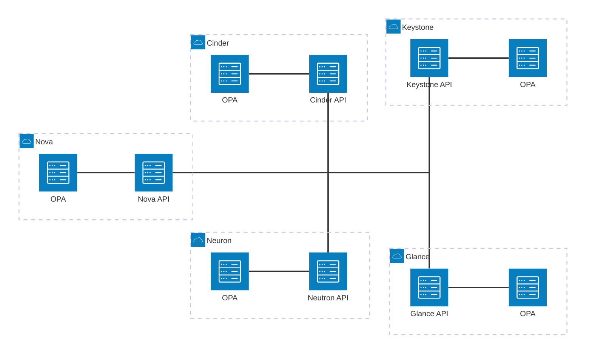

+++
draft = false
title = "Dynamic OpenStack authorization policies with Open Policy Agent"
description = "How to integrate `oslo.policy` with Open Policy Agent to build dynamic and easy reconfigurable policies and stop worrying about role explosion"
date = "2025-07-01"
author = "Artem Goncharov"
+++

# Dynamic Keystone policies with Open Policy Agent

At SysEleven we offer our customers different services including OpenStack,
Kubernetes, Monitoring and observability, Database as a Service and more. Every
of those services implement authentication and authorization in a very different
way, but we want to provide customers something more homogeneous and manageable
from a single UI and using the same credentials (when I have a service account
for one system I also want to be able to use it for other systems as well). This
sounds very logical, but hugely non-trivial to implement.

In our platform a decision to build a central Identity Access Management (IAM)
platform has been made. A relatively new hype in the authorization area is a
ReBAC (relation based access control), which is currently used by some big
players on the market. With that approach action authorization is based on the
presence of the connection between 2 nodes in the graph (direct or indirect).
OpenFGA is an open source software allowing user to describe desired node types
(actors and targets) and edges (reader, writer, admin, etc). We use it in
combination with the Keycloak which is taking responsibility of the user
management and authentication.

Integrating OpenStack Keystone with external identity and policy systems is
maybe non-trivial, but possible. This is a work in progress to improve
federation support in Keystone. What is, however a much bigger problem is to
integrate OpenStack with an external authorization service. As of the moment of
writing we rely on OpenStack roles with role assignments being pulled by
Keystone from OpenFGA during user login. Of course this is not the best solution
and we are working on a different type of integration that queries the data
directly from OpenFGA every time the data is required (it can be seen as storing
role assignments not in the database).

A question that most likely every OpenStack operator heard at least once is
whether it is possible to have a more fine granular roles than simply "reader",
"member" and "manager". After adding a few fine-granular roles a role explosion
situation comes very quickly making them very complex to maintain. So let's have
a look first at the basics of how authorization is being implemented in
OpenStack.

Authorization in OpenStack is a hybrid of RBAC (role based access control) and
ABAC (attribute based access control). A user gets a role assigned (either
directly or through the group membership) on a certain target (project or domain
or system). Every time a user is performing an API operation a set of things is
being evaluated to perform a decision:

- Has the user the required role assigned?

- Is the role assigned on the project the user is currently trying to use?

- Is the user, maybe, an admin and should be allowed to perform the operation
  independently of the scope?

- Is the user the owner of the target resource?

- ...

Such checks are unique for every operation and are described in the source code
of the service with the help of a library called `oslo_policy` with a policy
representation in a string form: `"identity:get_application_credential":
"(rule:admin_required) or (role:reader and system_scope:all) or rule:owner"`

In a human language it would translate to: get_application_credential operation
of the identity service is allowed if one of the following conditions is true:

- `rule:admin_required` evaluates to True (user has admin role)

- `role:reader and system_scope:all)` - user has reader role and authorized with
  the system scope and all target

- `rule:owner` - user is owner of the resource

Have I said "in the source code"? Yes, I did. Luckily it is possible to override
the default policy with the configuration file. Unfortunately this means that
first a new policy file need to be deployed to every node and the process
restarted/reloaded. With this limitation any consideration of having dynamics
in the authorization process does not make any sense. But if it is not really
possible to have a dynamic roles with `oslo_policy`, is it possible to delegate
authorization decision to the external system like OpenFGA? Yes, it is possible
to have a plugin for the `oslo_policy` that does something else. It could be an
http call to the external system, invocation of some library or anything else.
Since in our cloud we use OpenFGA as the authorization system, the very first
idea was to write a plugin that would query the OpenFGA. Unfortunately pretty
quickly differences between ReBAC, RBAC and ABAC start showing up and it becomes
clear, that no regular mortal is able to implement OpenStack policies with the
ReBAC model. As said above OpenStack uses a hybrid of RBAC and ABAC. And while
it is technically possible to cover certain aspects of that in ReBAC, it is
unacceptably complex. In addition to that there are certain aspects of OpenStack
policies where some services integrate additional dynamic data into the policy
evaluation. As such this is not something that can be delegated to the
operations stuff simply shaking up the responsibility to someone else.

OpenFGA is not the only solution on the market for implementing authorization
systems. One of the biggest player is the Open Policy Agent. It is a system that
has well established integrations with Kubernetes, Ceph, Terraform, and many
others. It is even possible to integrate OPA into the PAM layer on Unix systems
allowing controlling permissions on the operating system level. Implementing
OpenStack policies using the Open Policy Agent's Rego language is very straight
forward. In practice OPA even supports using the graph theory in the policies.
This allows having the current OpenStack policies implemented naturally in Rego
and be extended with the dynamic data and ReBAC style assignments providing a so
desired freedom.

## Open Policy Agent Rego language

As mentioned above Rego is a language used in the Open Policy Agent to describe
the desired policy behavior. It is not necessary an intuitive language, but
is also not unnecessary complicated. 

`oslo.policy` based description for listing application credentials:

```yaml
"identity:list_application_credentials": "(rule:admin_required) or (role:reader and system_scope:all) or rule:owner
"admin_required": "role:admin or is_admin:1"
"owner": "user_id:%(user_id)s"
```
The following policy permits the API request for admin users (when the user is
having the "admin" role assigned or the "is_admin" flag set to 1), or the user
has a "reader" role assigned for the system scoped token or the user is the
owner of the application credentials (identified with the check comparing the
"user_id" parameter of the request with the "user_id" of the authenticated
user). Such policy can be represented in the Rego language as follows:

```
allow if {
  # role:admin
  "admin" in input.credentials.roles
}

allow if {
  # role:reader and system_scope:all
  "reader" in input.credentials.roles
  input.credentials.system_scope == "all"
}

allow if {
  # user_id:%(user_id)s
  input.credentials.user_id == input.target.user_id
}
```

The example above defines 3 rules with the rule header stating "allow" as the
final authorization decision. The fact that all 3 rules are having the same
header is having the "OR" effect instructing OPA to permit the request if at
least one of the rules is evaluated to true.

First rule is ensuring "admin" is present in the credential roles list. The
second one evaluates to true when credential roles contain "reader" item AND the
"system_scope" credential attribute is set to "all". Last rule validates that
the "user_id" attribute of the credential is equal to the "user_id" attribute of
the target. All this rules are evaluated in parallel and when one of them is
true, the further evaluation is aborted immediately returning the result.

Let's see how to implement a fine granular access granting the user this rule
individually without allocation of the new roles. This is where the ReBAC
shines. It is possible to consider every API operation as a separate target
that can be accessed by the user though establishing of a direct relation.
Technically this is not much different to how it is implemented now, since access
to the target (API operation) is being granted to the user through the roles.

```
...
allow if {
    data.assignments["list_application_credentials"][input.credentials.user_id]
}
```

With this addition the request is being permitted by the OPA also if user_id
entry is present in the supplementary data under the
"list_application_credentials" section. Open Policy Agent separates policies
from the data objects (simply a json blob), while the "data" can be used by the
policies. Such data can be either provided in the request itself, just like
credentials and target are being used now, or it can be provisioned into the OPA
process separately with a completely separated life cycle. This example does not
uses the graph queries though for the explanation simplicity.

To help the operator to verify the policies OPA provides a framework allowing
writing tests for the policies. With it a set of verification for the decision
based on the different inputs can be written.

```
package identity.list_roles_test

import data.identity.list_roles

test_admin_required if {
  list_roles.allow with input as {"credentials": {"roles": ["admin"]}}
}

test_reader_and_system_scope_all if {
  list_roles.allow with input as {"credentials": {"system_scope": "all", "roles": ["reader"]}}
}

test_manager_and_not_domain_id_None if {
  list_roles.allow with input as {"credentials": {"roles": ["manager"], "domain_id": "foo"}}
}

test_direct_assignment if {
  list_roles.allow
    with input as {"credentials": {"user_id": "foo"}}
    with data.assignments as {"list_roles": {"foo": {}}}
}
```

## The `oslo.policy` plugin and first deployment design

`oslo.policy` supports dynamic plugins as the policy checks (the individual policy
conditions that evaluate to true or false) using the python's entrypoints
mechanisms. Open Policy Agent is designed to be accessed primarily using its API
exactly due to the fact that the running system might hold some data dynamically
pro visioned into it by some external system. It is also possible to compile
policies into the WASM binary, but using that from python in the OpenStack
ecosystem does not look like a good idea, therefore we are going to concentrate
on the REST API invocation of the OPA. `oslo.policy` currently supports the 'http'
checks. However there is not much possibility to prepare requests and responses
to how the OPA expects. Due to that a new dedicated check that is based on the
'http' check is being added. All what it is going to do is to translate the
policy data into the expected request, construct the url, send the request and
convert the response into what the `oslo.policy` requires.

With the communication between services (using the `oslo.policy` internally) and
the Open Policy Agent being based on the http protocol it is necessary to consider
how the OPA is deployed. The recommended architecture suggests that the OPA process
should be deployed in the side-car style for every process to keep the network
communication latencies as low as possible.



A communication with any external systems may fail in 10,000 different ways
starting from the remote service being not reachable or the timeout being
exceeded up to the system reached the limit of sockets in use. To improve the
system reliability the plugin implements a fallback to the default policy when
any problem occurs. This may be not ideal when a policy in OPA is more
permissive compared to the default one, but it is still most likely safer than
refusing or allowing all requests. Of course it also makes sense to further
improve that and make gating configurable (fail-open, fail-closed) or even
parameterizing the check so that it can be controlled on the rule level.

### "Target" and "Credentials" objects

Nearly every OpenStack service is using certain "container" object with the
target and credentials data. Some just pass a plain dictionary into the
`oslo.policy`, others define a class with attributes, some are passing the
database model directly. For example Manila passes "target" as a plain
dictionary in some calls and the database model in others. When a policy engine
known which attributes are necessary for the evaluation it can explicitly read
those attributes. When a policy decision is being done remotely all available
attributes must be passed instead. Due to the variety of containers with the
data a considerable amount of logic needs to be applied when preparing the
request since not even listing all available attributes can be done in the
general way. In addition to that only serializable data can be passed in the
request, so certain data fields must be discarded when preparing the request to
the OPA.

## Default policy translation into the `Rego` language

Manually rewriting all OpenStack policies does not make much sense. Policies are
already created to be consumed by machines, so machine can also translate the
policy into the different interpretation language. The part of the
`oslo.policy.opa` repository is the generator built in a similar way how the
`policy.yaml` file is being built, just that it produces a set of rego files for
the service. It even generates a set of unit tests for the policies.

```console
oslopolicy-opa-policy-generator --namespace keystone --output-dir opa_policies
```

In the same way another generator allows preparing the `policy.yaml` file. It
follows the same convention of the default `oslo.policy` configuration
generator.

```console
oslopolicy-opa-sample-generator --namespace keystone --output-file policy.yaml
```

### Neutron

OpenStack would not be OpenStack if there would be no exceptions. In particular
this statement always applies to Neutron (networking service). It already
defines custom policy checks in addition to the slightly modified order of
policy evaluation for the operations.

#### List operations and filtering

For list operations Neutron first fetches the resources matching the query from 
the database and afterwards it applies the policy to every record literally
post-filtering the records the user is not allowed to see. Afterwards for every
record that passed first filtering another iteration of policy evaluation starts
filtering record attributes the user is not allowed to see. This allows having
certain resource attributes only visible to administrators. 

A consequence of this approach is that for API operations that return 1000
entries (imagine a project with a big number of networks having thousands of
ports and performing a port list operation) and 10 (for simplicity) attributes
for every record a total of 11,000 API requests to the OPA process would need to
be processed for 1 user initiated operation. While OPA is designed to make any
authorization decision in under 1ms (named as the decision budget) even in the
most optimistic case it will take 11 seconds, which is not really acceptable.
Luckily OPA can be used not only to decide whether the operation should be
allowed or rejected, it can actually do much more and validate record attributes
policy in one go. It is even possible to feed an array of items to the
Open Policy Agent and let it filter out the items and further sanitize the
matching records erasing certain fields according to the policy requirements.
Moreover it is not only possible to decide whether the request should be allowed
or not, it is also possible to explain why it is not allowed. That would improve
user experience dramatically telling to the user why his request was rejected.
But since such change require much deeper changes including changes to the API
it is not considered here (but is evaluated for the Keystone reimplementation
initiative).

Additional check `opa_filter` allows combining making the general authorization
decision on the record and filtering attributes can be used to dramatically
reduce amount of the requests to the OPA. Using threading to further parallelize
requests from Neutron to OPA for improving the request processing time,
unfortunately, has proven not to work causing often sporadic freezes of Neutron.
And while, as said above, it is possible to feed the data batch to the OPA to
reduce amount of network operations it makes writing policies much more complex
and requires the data being batched on the `oslo.policy` side. With that it does
not look too promising to implement now.

```config
"get_port": "opa:get_port"
```

#### Modification operations

The resource modification operations are also evaluating the policy differently.
First a dedicated policy is being evaluated to determine whether the user is
allowed to perform it. The response of the operation is the being again
evaluated against the resource show policy mostly to filter out attributes the
user should not see.

#### "Ownership" check

Certain resources in Neutron are actually subresources of other resources
(subnet and ports are technically subresources of the network). Making
authorization decision on such subresource requires knowledge of the parent
resource attributes. When a user is attempting to perform an operation on the port,
the policy must resolve the network it belongs to. When such network is not
owned by the project the user is currently authenticated to, and also the one to
which the port belongs, the policy needs to check whether the network is shared
with the project. So when the network is shared with the target project, the
request will be accepted assuming other required checks are also satisfied.

Natively Neutron resolves the parent resource during the policy evaluation. When
an authorization decision is being delegated to the external system this
information either needs to be provided with the initial request or there must
be possibility to fetch it from within the policy engine dynamically. Logically,
certain operations or checks may not be executed inside of the policy engine
when the decision is already done based on the other rules, either the ones that
just completed faster or when they are having higher priority. Neutron owner
check is also only resolving the ownership when it is this check's turn. As such
unconditionally resolving the parent resource to place the information into the
request is not optimal. That means that the policy engine must be able to
resolve this data independently. OPA provides possibility to perform external
http requests and also to implement custom functions. The later, however,
requires recompilation of the OPA process, what heavily complicates the
situation. Sending the http call to the OpenStack, in it's turn, requires valid
authentication. Placing the authentication information into policies is also
making the process less flexible, as well as introduces potential for the
chicken-egg problem.

```yaml
"network_owner": "tenant_id:%(network:tenant_id)s"
```

Luckily the number of resources where the owner check is being applied is low,
only networks, subnets, security groups and floating ips need to be supported in
the current Neutron version. Additional constraint is that such checks only
require a very small subset of resource attributes. Therefore we went a way of
the least resistance and deployed tiny database proxy for the mentioned
resources. Since none of the required attributes can ever change on the resource
a http caching is helping to further restrict network and db operations.

```rego
get_network(id) := net if {net := http.send({  "url": concat("/", ["http://localhost:9098/network", id]),  "method": "get",  "timeout": "1s",  "cache": true}).body}

network_owner if {
 get_network(input.target.network_id).tenant_id == input.credentials.tenant_id
}
```

#### "Field" check

A field check is functionally very similar to the owner check with the exception
that it supports getting any attribute of the related resource and not only
determines the project_id the resource belongs to.

```yaml
"shared": "field:networks:shared=True"
```

#### Customization activation

As mentioned above Neutron customizes how the `oslo.policy` works. Especially
introduction of the performance optimization using the `opa_filter` check
requires enabling it in Neutron. Currently Neutron overrides the policy
enforcement using the hook that is injected upon the application start

```python
## neutron/pecan_wsgi/app.py

def v2_factory(global_config, **local_config):
    # Processing Order:
    #   As request enters lower priority called before higher.
    #   Response from controller is passed from higher priority to lower.
    app_hooks = [
        hooks.UserFilterHook(),  # priority 90
        hooks.ContextHook(),  # priority 95
        hooks.ExceptionTranslationHook(),  # priority 100
        hooks.BodyValidationHook(),  # priority 120
        hooks.OwnershipValidationHook(),  # priority 125
        hooks.QuotaEnforcementHook(),  # priority 130
        hooks.NotifierHook(),  # priority 135
        hooks.QueryParametersHook(),  # priority 139
        hooks.PolicyHook(),  # priority 140
    ]
    app = pecan.make_app(root.V2Controller(),
                         debug=False,
                         force_canonical=False,
                         hooks=app_hooks,
                         guess_content_type_from_ext=True)
    startup.initialize_all()
    return app
```

This allows such hooks to be overridden. `oslo.policy.opa` project delivers the
custom neutron starting factory with the alternative `PolicyHook`. It can be
activated using the `paste.ini` file

```config
[app:neutronapiapp_v2_0]
paste.app_factory = oslo_policy_opa.neutron:APIRouter.app_factory
```

It could be eventually more flexible to let some form of the configuration file
to be used, but anything is better than patching the service code.

## Real deployment and faced issues

Not following the suggested deployment architecture is most likely having a very
high price tag. Amount of network traffic between OpenStack service and the
dedicated Open Policy Agent is very high, so keeping the latency as low as
possible is the most important thing to take care of.

`oslo.policy` library strongly suggests to use namespacing for the policy
isolation. Unfortunately almost no OpenStack project really follows that
suggestion. Due to that it is not easily possible to serve policies for
different services by the single OPA instance. As such when multiple services
are deployed on the single host multiple OPA instances must be started (every
one on a different port). And while it sounds like a waste there is one crucial
benefit - the smaller the policy served by the OPA instance - the faster it is
and the less memory it uses.

### Eventlet hell

Majority of the OpenStack services still rely on the long deprecated `eventlet`
library for implementing concurrency. This is achieved in particular through
monkey patching certain system calls and certain widely used libraries.
After first rollout of the OPA powered services some of them started showing
sporadic timeouts on the network communication. The default timeout for the
`oslo.policy` to `opa` communication is set to 1 second, which is already too
much, under normal conditions authorization decision must not require more than
1ms, what OPA itself delivers. However this was timing out on the eventlet
powered services. First guess is that the OPA may take sometimes much longer,
maybe while being under the stress. OPA provides possibility to capture wide set
of performance metrics including the response timing histograms. Decision logs
provide a more detailed view on each individual call. After all the possible
metrics have been enabled and captured using Prometheus nothing suspicious
became visible. Another idea was that the Garbage collection causes timeouts
when it is being executed. Exposed metrics include also the duration of the
garbage collection. And while this indeed happens often enough, it never took
more than 100ms in our observations.

Tracing down the networking revealed the actual issue, while the request is
being processed by the OPA in a regular 1ms, the response is being sent and even
acknowledged by the kernel, the service does not see this response, or not
granted time by the eventlet to process the response, resulting in the timeout -
sometimes connection timeout, sometimes waiting for the response. We tried to
eliminate as many layers from the communication as possible and even went to
implementing the communication using the `urllib` library directly. Unfortunately
this did not have any positive effect.

Raising the timeout to 2s helped majority of the services, but not Nova. Most
likely the reason is that Nova does a lot of additional things when processing a
presumably simple call of listing servers. Raising this timeout even more seems
like a very bad idea, however the fact that the response is being given to the
kernel there is not much more what could be done. Technically the same fact
means that the request processing itself inside Nova is not having any chance to
complete, so the raised timeout is not changing anything.

While all of the OpenStack operators desperately wait for the eventlet to
finally disappear from OpenStack, we will continue experimenting trying to fix
the problem.

### Threading

As mentioned above in the Neutron specifics section, one of the potential
performance improvements with regards to the policy evaluation for API
operations with plenty of the resources is to parallelize requests. That
actually also fails due to the eventlet. In practice use of threading in the
`oslo.policy` plugin causes much more harm - the Neutron process freezes
sporadically.

### Raw sockets

AppArmor, SELinux, or maybe even simply the container runtime capabilities may
forbid use of raw sockets by the processes. This is, however, exactly what is
being used when the OPA url uses the hostname instead of the IP address. This
happens deep in the system dns resolving, so there is no direct influence on
that. It makes most sense to use IP address (127.0.0.1) for OPA directly to
prevent this and to have additional performance improvement saving perhaps some
nanoseconds on the name resolution.

## User defined or self-served roles

In the course of the deep dive into the world of authorization in OpenStack one
conclusion becomes apparent: it is not possible to allow users to manage roles
or authorizations in general themselves, at least not for now. There are
multiple reasons for that, but the most important one is that services are not
ready for that and are not moving into the right direction.

As mentioned in the Neutron section above, some APIs implement filtering on the
policy level. That means that the backend fetches all resources from the
database and afterwards a policy filters out entities or entity attributes that
the user is not supposed to see based on the permissions (roles) that the user
is granted. If users themselves would be able to freely define roles it would be
very easy to expose data of the different domains.

An OpenStack wide discussion should be initiated should this direction be ever
explored. It would be possible to implement such roles in an additive way where
users would be only able to write policy parts to be integrated into the general
policy still centrally managed by the cloud administrators. However, services
should strive to implement changed that guarantee that no sensitive data is being
exposed to unauthorized users.

## Central policy management

An interesting approach for the central management of the policies would be to
manage them in Keystone. Actually policies were previously stored inside of the
Keystone and deprecated since it is not an enforcement engine. It may make sense
to review this decision though. Here the policies are still not being
enforced by the Keystone, but Keystone serves the current policy bundles to be
picked up by the local OPA processes.

As of now we are using the standard DevOps approach of having a single git
repository where all policies are managed. CI/CD pipelines are running all
policy tests, build OCI containers with policies (one container per service) and
publish them into the internal registry. OPA processes are connecting to the
registry and periodically synchronize the corresponding policy.

## Conclusion

Open Policy Agent is a powerful tool for policy enforcement. With just a little
effort it integrates easily with the OpenStack's `oslo.policy` framework and
simplifies policy management. It enables dynamic, fine granular policies,
testing and decision logging. And while not every OpenStack project can be used
without issues, those can be overcome guaranteeing authorization decision in
under 1ms.
